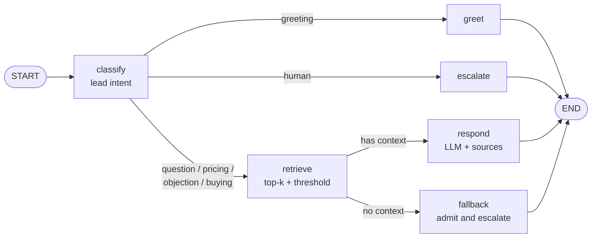

# vendas-agent

Conversational sales agent that **sells from the client's own product knowledge base** (RAG), with grounded answers, source citations and *guardrails* (if there is nothing to base an answer on, it doesn't make things up: it admits it and escalates to a human).

Switching clients = switching a folder. No code changes.

```
examples/nimbus/
├── product.toml     # name, tone of voice, plans and prices, rules, CTA, escalation contact
└── docs/*.md|txt    # the knowledge base (FAQ, plans, integrations, objections...)
```

> The bundled example (`examples/nimbus`) and the keyword intent classifier are in Brazilian Portuguese, so the sample questions below are too.

## How it works



- **Nodes are pure functions** over a state (`SalesNodes` in `agent.py`): easy to test with a fake LLM.
- **The same flow runs two ways**: LangGraph (`pip install .[graph]`) or plain Python (`run_sequential`). A parity test covers both.
- **Dependencies via `Protocol`** (`LLMClient`, `Embedder`, `VectorStore`, `IntentClassifier`): the core knows no vendor. Picking concrete implementations happens only in `bootstrap.py`.
- **Anti-hallucination guardrail**: below the similarity threshold the LLM **is not even called**; the agent says it doesn't know and hands off to a specialist. Exception: pricing questions are also covered by the plans in `product.toml`.
- **Conversation memory** with a bounded window (`MAX_HISTORY_TURNS`).
- **Evaluation**: `evals/dataset.jsonl` + `python -m vendas_agent eval` check intent, cited source, *grounding* and escalation. Runs in CI as a regression gate.

## Running (no keys at all, offline demo mode)

```bash
python -m venv .venv && source .venv/bin/activate
pip install -e ".[dev]"

python -m vendas_agent ask "Quanto custa o plano Pro?"
python -m vendas_agent chat
python -m vendas_agent eval
```

Demo mode uses *feature hashing* embeddings and an extractive "LLM" that quotes the best passage: it shows retrieval, routing and guardrails working, but **does not generate text**.

## With a real LLM and real embeddings

```bash
pip install -e ".[anthropic,openai,graph]"
cp .env.example .env        # fill in the keys and export the variables
export ANTHROPIC_API_KEY=...  EMBEDDER=openai  OPENAI_API_KEY=...
python -m vendas_agent chat
```

With `ANTHROPIC_API_KEY` set, `--llm auto` mode uses Claude to answer **and** to classify intent (falling back to the keyword classifier if the response is unusable). The model is configurable via `ANTHROPIC_MODEL`.

## Persisting to PgVector

```bash
pip install -e ".[pgvector]"
docker compose up -d db
export STORE=pgvector
python -m vendas_agent ingest --kb examples/nimbus
python -m vendas_agent chat --kb examples/nimbus
```

A single table (`kb_chunks`) serves multiple clients: each row has a `kb_id` (derived from the folder name), so each knowledge base is isolated and reindexed independently. **HNSW** index with cosine distance. If you change `EMBEDDER`, the vector dimension changes: use a different database/table.

## Adding a new client

1. Copy `examples/nimbus` to `clients/acme`.
2. Edit `product.toml` (product, tone, plans, CTA, contact, `extra_rules`).
3. Replace `docs/` with the client's documents (`.md` or `.txt`; `#` headings become citable sections).
4. `python -m vendas_agent --kb clients/acme chat`
5. Write an `evals/acme.jsonl` with real questions and run `eval --dataset evals/acme.jsonl`.

## Quality

```bash
make check     # ruff check + ruff format --check + mypy (strict) + pytest with coverage
make fmt       # auto-fix style
```

CI (GitHub Actions) runs the same on Python 3.11 and 3.12, plus `eval`.

## Technical decisions

| Decision | Why |
|---|---|
| Dependency-free core, integrations as *extras* | Fast, deterministic tests; install only what you use |
| `Protocol` instead of inheritance | Swap vendor/fake without touching the agent; mypy checks the structure |
| Refuse below the threshold | In sales, making up a price or feature is worse than saying "I don't know" |
| Chunking by Markdown section | Each chunk is one topic and becomes a readable citation (`planos.md › Pro`) |
| TOML for product configuration | `tomllib` is in the stdlib; editable by non-programmers |
| CTA appended by code, not by the LLM | Critical sales copy stays deterministic |
| Optional LangGraph | The flow is simple; the graph pays off once there are loops, checkpoints and *human-in-the-loop* |

## Known limitations

- The offline embedder is lexical (no synonyms); in production use real embeddings and **tune the** `MIN_SIMILARITY` **threshold** by measuring against the evaluation dataset.
- The keyword classifier is a Portuguese baseline; negations ("não quero contratar", "I don't want to buy") fool it. The LLM classifier handles this better.
- No *reranker*, hybrid search (vector + full-text) or query rewriting.
- `pgstore.py` and `OpenAIEmbedder` have no automated tests against real services (they need Postgres/credentials); all other modules are covered by tests with *fakes*.
- No grounding check *after* generation (LLM-as-judge); only the guardrail before it.
- No API-level authentication/multi-tenancy: it is a library + CLI.

## Next steps

Reranker and hybrid search (`tsvector` + RRF) · grounding-check node with *retry* · LangGraph checkpointer on Postgres (memory per `thread_id`) · FastAPI (async) API · WhatsApp/web chat integration · Langfuse tracing (`pip install .[tracing]`, set `LANGFUSE_PUBLIC_KEY` before starting) · business metrics (conversion by intent).

## Structure

```
src/vendas_agent/
├── models.py       immutable domain types (dataclasses, StrEnum, TypedDict)
├── config.py       Settings read from environment variables
├── knowledge.py    loads and validates product.toml + docs/
├── chunking.py     Markdown sections, packing, overlap
├── embeddings.py   Protocol + HashingEmbedder (offline) + OpenAIEmbedder
├── store.py        Protocol + InMemoryVectorStore
├── pgstore.py      PgVectorStore (parameterized SQL, HNSW, multi-client)
├── indexing.py     chunk → embed → store
├── llm.py          Protocol + AnthropicClient + ExtractiveDemoLLM
├── intent.py       classifiers (keyword and LLM)
├── agent.py        nodes, routers, prompt, SalesAgent
├── graph.py        same flow in LangGraph
├── evaluation.py   evaluation harness
├── bootstrap.py    composition root
├── tracing.py      optional Langfuse
├── utils.py        typed `timed` decorator
└── cli.py          chat | ask | ingest | eval
```
