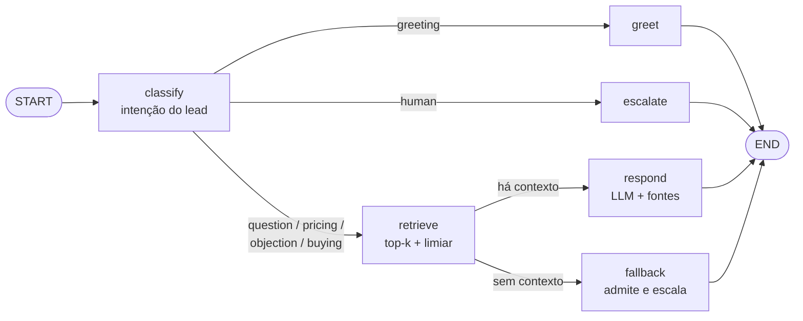

# vendas-agent

Agente de vendas conversacional que **vende a partir da base de conhecimento do produto do cliente** (RAG), com respostas fundamentadas, citação de fontes e *guardrails* (se não há base para responder, ele não inventa: admite e escala para um humano).

Trocar de cliente = trocar uma pasta. Nenhuma linha de código muda.

```
examples/nimbus/
├── product.toml     # nome, tom de voz, planos e preços, regras, CTA, contato de escalonamento
└── docs/*.md|txt    # a base de conhecimento (FAQ, planos, integrações, objeções...)
```

## Como funciona



- **Nós são funções puras** sobre um estado (`SalesNodes` em `agent.py`): fáceis de testar com LLM falso.
- **O mesmo fluxo roda de duas formas**: LangGraph (`pip install .[graph]`) ou Python puro (`run_sequential`). Há um teste de paridade entre os dois.
- **Dependências por `Protocol`** (`LLMClient`, `Embedder`, `VectorStore`, `IntentClassifier`): o núcleo não conhece fornecedor. A escolha da implementação concreta fica só em `bootstrap.py`.
- **Guardrail anti-alucinação**: abaixo do limiar de similaridade o LLM **nem é chamado**; o agente responde que não sabe e passa para um especialista. Exceção: perguntas de preço também são cobertas pelos planos do `product.toml`.
- **Memória de conversa** com janela limitada (`MAX_HISTORY_TURNS`).
- **Avaliação**: `evals/dataset.jsonl` + `python -m vendas_agent eval` verificam intenção, fonte citada, *grounding* e escalonamento. Roda no CI como portão de regressão.

## Rodando (sem nenhuma chave, modo demo offline)

```bash
python -m venv .venv && source .venv/bin/activate
pip install -e ".[dev]"

python -m vendas_agent ask "Quanto custa o plano Pro?"
python -m vendas_agent chat
python -m vendas_agent eval
```

O modo demo usa embeddings por *feature hashing* e um "LLM" extrativo que cita o melhor trecho: serve para ver recuperação, roteamento e guardrails funcionando, mas **não gera texto**.

## Com LLM real e embeddings reais

```bash
pip install -e ".[anthropic,openai,graph]"
cp .env.example .env        # preencha as chaves e exporte as variáveis
export ANTHROPIC_API_KEY=...  EMBEDDER=openai  OPENAI_API_KEY=...
python -m vendas_agent chat
```

Com `ANTHROPIC_API_KEY` definida, o modo `--llm auto` usa Claude para responder **e** para classificar a intenção (com fallback para o classificador por palavras-chave se a resposta for inutilizável). O modelo é configurável em `ANTHROPIC_MODEL`.

## Persistindo no PgVector

```bash
pip install -e ".[pgvector]"
docker compose up -d db
export STORE=pgvector
python -m vendas_agent ingest --kb examples/nimbus
python -m vendas_agent chat --kb examples/nimbus
```

Uma tabela (`kb_chunks`) atende vários clientes: cada linha tem `kb_id` (derivado do nome da pasta), então cada base é isolada e reindexada independentemente. Índice **HNSW** com cosseno. Se mudar de `EMBEDDER`, a dimensão do vetor muda: use outro banco/tabela.

## Criando um novo cliente

1. Copie `examples/nimbus` para `clients/acme`.
2. Edite `product.toml` (produto, tom, planos, CTA, contato, `extra_rules`).
3. Substitua `docs/` pelos documentos do cliente (`.md` ou `.txt`; títulos `#` viram seções citáveis).
4. `python -m vendas_agent --kb clients/acme chat`
5. Escreva um `evals/acme.jsonl` com perguntas reais e rode `eval --dataset evals/acme.jsonl`.

## Qualidade

```bash
make check     # ruff check + ruff format --check + mypy (strict) + pytest com cobertura
make fmt       # corrige estilo automaticamente
```

CI (GitHub Actions) roda o mesmo em Python 3.11 e 3.12 + o `eval`.

> **Primeira execução:** rode `make fmt` uma vez antes do primeiro commit. O código foi escrito para passar em Ruff/mypy, mas o autor original não conseguiu executar essas ferramentas no ambiente de geração; pequenos ajustes de import/formatação ou de tipos podem aparecer.

## Decisões técnicas

| Decisão | Por quê |
|---|---|
| Núcleo sem dependências, integrações como *extras* | Testes rápidos e determinísticos; instala só o que usa |
| `Protocol` em vez de herança | Trocar fornecedor/fake sem tocar no agente; mypy valida a estrutura |
| Recusar abaixo do limiar | Em vendas, inventar preço ou funcionalidade é pior que dizer "não sei" |
| Chunking por seção Markdown | Cada chunk é um tópico e vira uma citação legível (`planos.md › Pro`) |
| TOML para configuração do produto | `tomllib` está na stdlib; humano-editável por quem não programa |
| CTA anexado por código, não pelo LLM | Texto comercial crítico é determinístico |
| LangGraph opcional | O fluxo é simples; o grafo traz valor quando houver loops, checkpoints e *human-in-the-loop* |

## Limitações conhecidas

- O embedder offline é lexical (não entende sinônimos); em produção use embeddings reais e **ajuste o limiar** `MIN_SIMILARITY` medindo com o dataset de avaliação.
- O classificador por palavras-chave é um baseline em português; negações ("não quero contratar") o enganam. O classificador por LLM resolve melhor.
- Sem *reranker*, busca híbrida (vetorial + full-text) nem reescrita de query.
- `pgstore.py` e `OpenAIEmbedder` não têm teste automatizado contra serviços reais (exigem Postgres/credenciais); os demais módulos são cobertos por testes com *fakes*.
- Não há verificação de fundamentação *depois* da geração (LLM-as-judge); só o guardrail antes.
- Sem autenticação/multi-tenant a nível de API: é uma biblioteca + CLI.

## Próximos passos

Reranker e busca híbrida (`tsvector` + RRF) · nó de verificação de fundamentação com *retry* · checkpointer do LangGraph em Postgres (memória por `thread_id`) · API FastAPI (async) · integração WhatsApp/web chat · tracing com Langfuse (`pip install .[tracing]`, defina `LANGFUSE_PUBLIC_KEY` antes de iniciar) · métricas de negócio (conversão por intenção).

## Estrutura

```
src/vendas_agent/
├── models.py       tipos de domínio imutáveis (dataclasses, StrEnum, TypedDict)
├── config.py       Settings lidas de variáveis de ambiente
├── knowledge.py    carrega e valida product.toml + docs/
├── chunking.py     seções Markdown, empacotamento, overlap
├── embeddings.py   Protocol + HashingEmbedder (offline) + OpenAIEmbedder
├── store.py        Protocol + InMemoryVectorStore
├── pgstore.py      PgVectorStore (SQL parametrizado, HNSW, multi-cliente)
├── indexing.py     chunk → embed → store
├── llm.py          Protocol + AnthropicClient + ExtractiveDemoLLM
├── intent.py       classificadores (palavras-chave e LLM)
├── agent.py        nós, roteadores, prompt, SalesAgent
├── graph.py        mesmo fluxo em LangGraph
├── evaluation.py   harness de avaliação
├── bootstrap.py    composition root
├── tracing.py      Langfuse opcional
├── utils.py        decorator tipado `timed`
└── cli.py          chat | ask | ingest | eval
```
